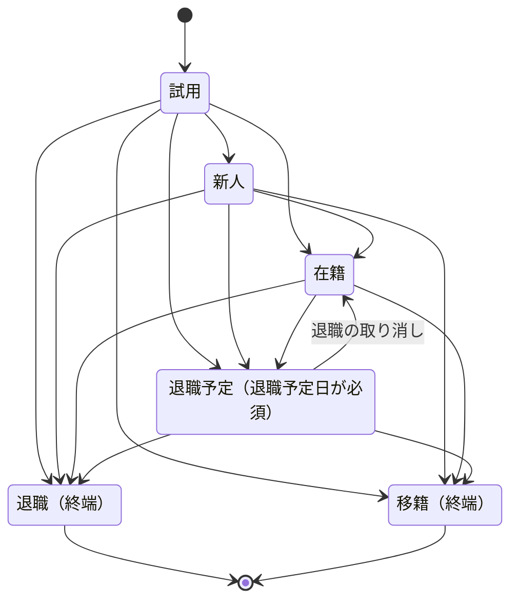

# 設計メモ

各テーマについて、「何を守りたいか」と「それをどう保証しているか」を短くまとめます。

## 1. スタッフの在籍状態の遷移（`src/staff-lifecycle.ts`）



- **遷移を1つの表で定義する。** 管理画面のドロップダウン（`nextStaffStatuses`）と、サーバ側の更新ガード（`isValidTransition`）が同じ表を参照します。「画面では選べないのに、API を直接呼べば通る」というずれが起きません。
- **終端は一方向。** 退職・移籍した人を在籍中の状態へ戻す遷移はありません。同じ店舗に戻る場合は、新しく `trial` から始めます。過去の在籍期間と混ざらないようにするためです。
- **遷移に伴う項目の更新も、ここで決める。** 退職予定日が必須か（`requiresLeaveDate`）、退職日を記録するか（`setsLeftAt`）、退職予定日を消すか（`clearsScheduledLeave`）を関数にしておくと、呼び出し側は条件分岐を持たずに済みます。
- **未知の状態は fail-closed。** 型は実行時には消えるので、DB や API から来た文字列は何でも入りえます。状態の一覧にない値（`'constructor'` のような Object のプロパティ名も含む）は、遷移を許可せず、選択肢も空にします。
- 図と表は、管理者が手動で起こせる遷移を表しています。`rookie → active`（在籍日数に達したとき）と `leaving → left`（退職予定日に達したとき）は、日付による自動遷移としても起きますが、その実行は定期実行ジョブ側で扱うので、このサンプルには含めていません。

## 2. 現在地検索の入力チェック（`src/geo-search.ts`）

URL の `?near=<lat>,<lng>&radius=<km>` を解析・検証・生成する関数です。

- **無効な入力は「検索しない」に倒す。** 座標が範囲外・非数値なら `null` を返し、通常の検索に戻します。一方、半径だけが不正な場合は既定値（10km）に直して、検索自体は続けます。
- **`Number()` の暗黙変換を信用しない。** `Number('')` は `0`、`Number('0x22')` は `34` になります。そのため、10進数の正規表現で先に弾いています。これをしないと、`near=12.5,` が「経度 0」として検索されます。半径も同じで、`'0x3'` や `'3e0'` は `Number()` では許可値の 3 になりますが、10進の整数以外の表記は受け付けずに既定値へ倒します。
- **半径は許可値だけ。** 3 / 5 / 10 / 20 km 以外は受け付けません。URL を書き換えても、想定外に広い範囲は検索できません。
- **極端に長い入力は先に弾く。** `near` が 64 文字を超えたら、正規表現や `Number()` に渡す前に `null` にします。
- **座標は小数3桁（約110m）に丸めてから URL に載せる。** 最寄駅くらいの精度で十分です。桁を減らすことで、正確な現在地がアクセスログや Referer に残るのを避けます。
- 画面（URL の組み立て）とサーバ（URL の解析）が同じ関数を使います。

## 3. 料金プランが順位に影響しないランキング（`src/ranking.ts`）

- **プランを型で締め出す。** 集計の段階で `plan` を持たない `RankedShop` を作ります。比較関数は型のうえでプランを参照できません。テストでは、5店舗へのプランの割り当てを全通り（3^5 = 243 通り）試し、順位が変わらないことを確かめています。
- **口コミが少ない店舗の補正（ベイズ平均）。** 単純な平均では、「5.0 が1件」の店舗が「4.8 が50件」の店舗より上に出ます。そこで IMDb や BoardGameGeek と同じ形のベイズ平均を使います。全体の平均 C の口コミを各店舗に m = 5 件ずつ足してから平均を取ります。

  ```
  調整後スコア = (星の合計 + m × C) / (件数 + m)
  ```

  - C は、既定では渡された口コミ全体の平均です。検索条件で絞った口コミを渡すと C が変わって順位が揺れるので、その場合は全体から計算した値を `prior` で渡します。
  - 補正の強さは C によって変わります。m = 5 のとき、C が約 4.755 より高いと、「5.0 が1件」の店舗が「4.8 が50件」の店舗より上に来ます。
  - 画面に表示する星は素の平均（`averageRating`）です。調整後スコアは、順位の根拠として使います。
- **同点の扱い：** 調整後スコア → 口コミの件数 → 店名（読みがなで五十音順・アルファベット順）→ 店舗 ID の順に比べます。最後まで同点が残らないようにしているので、DB が行を返す順番によって順位が変わりません。
- **スコアは誤差なしで比べる。** C を「合計 ÷ 件数」という整数の組のまま持ち、調整後スコアを分数のまま `BigInt` のたすき掛けで比べます。浮動小数点の誤差のせいで「同点なら件数順」のルールが崩れることはありません。
  - 例：C = 4/3 のとき、「評価2が1件」と「評価1と2が5件ずつ」の店舗は、分数ではどちらも 13/9 で同点です。ところが浮動小数点では 1.4444444444444444 と 1.4444444444444442 になり、小数で比べると件数の少ない店舗が上に来てしまいます。この例はテストに入れています。
- **入力を検査する。** 同じ店舗 ID が2行ある（JOIN の重複など）と同じ店舗が2枠を占めるので、例外にします。`prior` は「1〜5 の評価を集めた合計」として成り立つ値（`0 < 件数 ≤ 合計 ≤ 5 × 件数` の整数）だけを受け付けます。`compareRankedShops` を直接呼んだ場合も同じ検査をします。
- 口コミが0件の店舗は、プランに関係なくランキングの対象外です。

## 4. 障害時に空の結果をキャッシュしない仕組み（`src/last-good-cache.ts`）

**背景：** 一時的な DB 障害が起きたとき、取得処理が例外を握りつぶして 0 件を返しました。その 0 件が 60 秒間キャッシュされ、全員に空のランキングが表示されました。キャッシュから見ると、「正常な 0 件」と「障害による 0 件」は区別できません。

**対策：**

- **取得の失敗は例外にする。** 取得処理（fetcher）は、失敗したら空を返さずに例外を投げます。キャッシュは例外を受けたら何も保存せず、例外を呼び出し側へそのまま伝えます。
- **直前の正常な結果を残す。** 失敗しても、保存済みの結果は上書きしません。`lastGood()` で取り出せるので、呼び出し側は「古い結果を表示する」か「エラー表示にする」かを選べます。
- **保存してよい結果かを判定する。** `isCacheable` が `false` を返した結果（例：空配列）は、呼び出し側へ返しますが保存しません。本当に 0 件の場合もあるので返しはしますが、60 秒間固定することはしません。
- **同時のリクエストは1回の取得にまとめる。** 取得中の Promise を共有し、`finally` で片付けます。失敗した Promise が残り続けることはありません。

**取得処理（fetcher）に求める約束：** キャッシュ側では検査しないので、fetcher が守ります。

- **失敗は、`undefined` や `null` ではなく例外で伝える。** 例外を投げずに返した値は、「正常な結果」として扱われます。
- **取得処理自身がタイムアウトを持つ。** DB の `statement_timeout` や HTTP クライアントのタイムアウトなどです。fetcher が終わらないと、同時に待っている `get()` もすべて終わりません。適切な待ち時間は、取得の中身を知っている fetcher 側で決めます。
